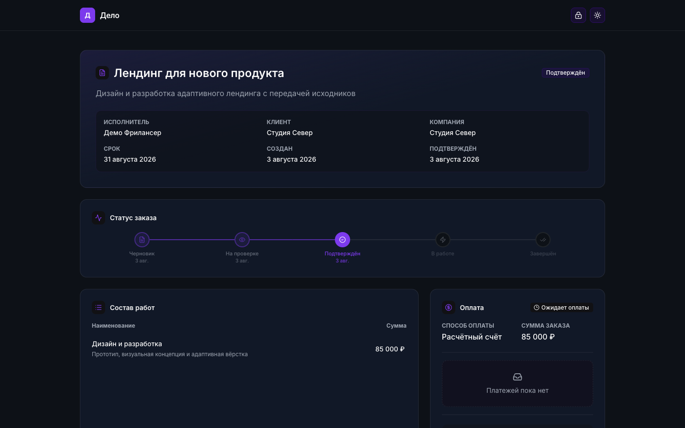
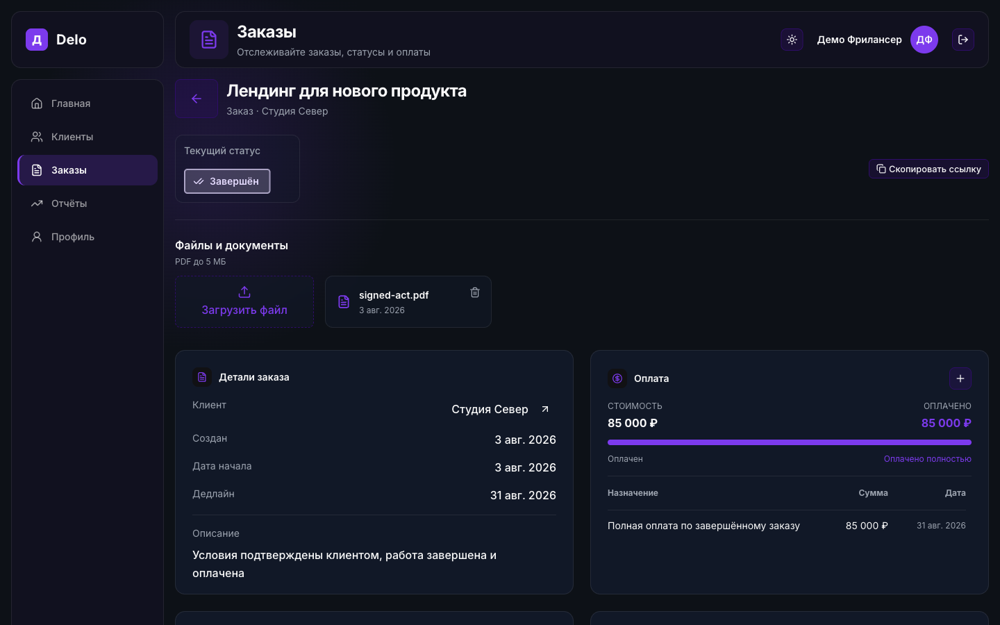

# Delo

<p align="center">
  
</p>

**Delo** помогает самозанятым и фрилансерам вести заказ от первых договорённостей до оплаты: зафиксировать условия, отправить клиенту ссылку для подтверждения и сохранить всё по заказу в одном месте.

[Посмотреть интерфейс](#интерфейс) · [Как проходит заказ](#как-проходит-заказ) · [Локальный запуск](#локальный-запуск)

## Интерфейс

**Для клиента.** Публичная страница показывает условия, состав работ, статус и оплату. Клиент может подтвердить заказ по ссылке без регистрации.



**Для исполнителя.** В карточке заказа видны клиент, сроки, платежи и прикреплённые PDF. Скриншоты показывают демонстрационные данные.



## Как проходит заказ

1. **Создайте клиента и заказ.** Укажите работы, цену, даты и условия.
2. **Поделитесь ссылкой.** Клиент откроет публичную страницу и подтвердит заказ без учётной записи.
3. **Ведите исполнение.** Меняйте статус, отмечайте частичные и полные оплаты, прикрепляйте PDF; события сохраняются в истории.

Списки клиентов и заказов поддерживают поиск, фильтрацию и постепенную подгрузку. Для входа в сервис есть подтверждение почты и восстановление пароля.

## Локальный запуск

Нужны Node.js с npm, доступный **PostgreSQL** и Docker. Docker Compose в этом репозитории запускает Mailpit и MinIO, но не базу данных.

```bash
npm install
cp .env.example .env.local
openssl rand -base64 32
```

В `.env.local` укажите адрес базы в `DATABASE_URL` и сохраните результат `openssl` в `AUTH_SECRET`. Остальные значения из примера подходят для локального Mailpit и MinIO.

```bash
npm run docker:up
npx prisma migrate dev
npm run dev
```

Откройте [приложение](http://localhost:3000). Письма доступны в [Mailpit](http://localhost:8025), файлы — в [консоли MinIO](http://localhost:9001).

## Разработка

- `src/app/` — страницы, layouts и API; `src/features/` — сценарии интерфейса; `src/shared/` — общие компоненты и утилиты.
- `src/actions/` — серверные действия; `prisma/schema.prisma` — модель данных.
- Интерфейс: Next.js 16, React 19, TypeScript, Tailwind CSS 4 и shadcn/ui. Данные: PostgreSQL и Prisma 7; авторизация: Auth.js v5. Письма отправляются через Mailpit локально и Resend в других окружениях; файлы хранятся в S3-совместимом хранилище.

Проверки: `npm run lint`, `npm run typecheck`, `npm run format:check`. Готовые миграции применяются командой `npm run migrate`.

## Лицензия

[MIT](./LICENSE).
